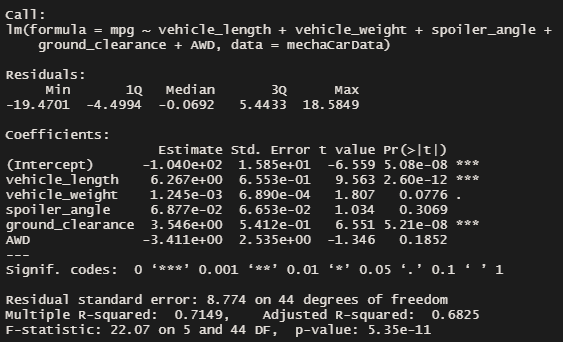
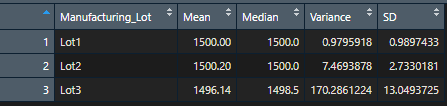
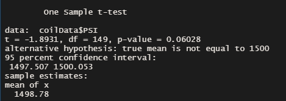
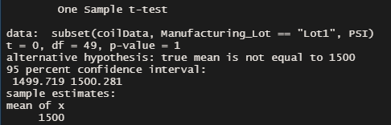
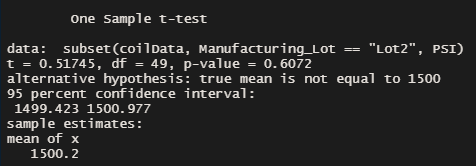
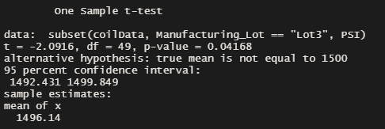

# MechaCar_Statistical_Analysis

## Overview
The analyst at AutosRUs was asked to analyze the production data for MechaCar.  The prototype is having production issues. Using the provided data, I was asked to find out what variables affect the MPG and whether the suspension coils are being manufactured accurately within and between car lots.

## Results

### Linear Regression to Predict MPG
To understand which variables had the largest effect on MPG, linear regression of MPG was performed against all other design specifications. Utilizing a significance threshold of 0.05, the following results were obtained **Figure 1**:
-	Vehicle length and ground clearance variables predict MPG values, as did the intercept.  
-	The null hypothesis was rejected, because the p value for the overall model was much less than 0.05.
-	The linear model forecast variance in MPG successfully. The R-squared value of .71 suggests a strong relationship between the variables and MPG.  The model is overfit, it contains variables that did not prominently contribute to the variance in MPG.

**Figure 1:** Screenshot of the linear regression output

### Summary Statistics on Suspension
To assess whether the PSI capacities of suspension coils across lots has been consistent, I analyzed the mean, median, variance, and standard deviation of PSI for all lots combined and each individual lot.  The design specs state that the variance for the suspension coils should be within a 100 PSI range.  The results were as follows:
-	The specifications were achieved across all lots combined (**Table 1**) and for lots 1 and 2 (**Table 2**). Lot 3 has a variance of 170 PSI, failing the specs (**Table 2**).

**Table 1:** Basic statistics for all cars across the three lots

**Table 2:** Basic statistics for all cars in each lot

### T-Tests on Suspension Coils
To determine if the lots have a statistically different capacity from the population mean of 1500 PSI t-tests were performed. With a significance of 0.05,these results were determined:
-	There was not statistical difference between the PSI of the suspension coil for all lots, or lots 1 and 2 individually and the population mean. **Figs 2-4** There is a significant difference between lot 3 and the population **Fig 5*.

**Figure 2:** T-test for all lots combined versus the expected population mean of 1500

**Figure 3:** T-test for lot 1 versus the expected population mean of 1500

**Figure 4:** T-test lot 2 versus the expected population mean of 1500

**Figure 5:** T-test for lot 3 versus the expected population mean of 1500

## Future Work
### Study Design: MechaCar vs Competition
To determine how MechaCar performs in relation to other organizations, we should test the following metrics for the new design and the vehicles most in competition with it from other manufacturers:

1)	city fuel efficiency
2)	crash rating

The hypotheses for these metrics are:
1)	Null Hypothesis: MechaCar is equal to or less fuel efficient than its competitors.  Alternate Hypothesis: Mechacar is more fuel efficient than its competitors.
2)	Null Hypothesis: MechaCar does not have a better crash rating than its competitors.  Alternative Hypothesis: Mechacar has a better crash rating than its competitors.

To test these variables, the city fuel efficiency and crash rating should be tracked for at least 50 MechaCars.  From this we can evaluate MechaCar’s average performance.  The reported fuel efficiency and crash rating can then be researched for models that are in competition with MechaCar to ascertain the population means for these variables.  Using a one-sample T-test MechaCar’s mean city fuel efficiency and mean crash rating can be compared to the metrics of the competition.  
